# 一、简介

一款基于文件管理器的可多端运行（Linux、Windows、MacOS、Android等）的私有云盘。

主要功能包括：

1. 支持主流操作系统，包括Windows、Linux、MacOS、Web浏览器、Android和iOS，甚至包括路由器。
2. 支持分享，将自己的文件分享给其他人。
3. 文件存于操作系统的文件系统中，不会因系统升级而丢失数据。
4. 支持私部署。文件在自己的服务器，安全又可靠，容量无限大。
5. 支持多账号。一人部署，全家共享使用，互不干扰。
6. 支持SSH、SFTP协议。不仅是文件管理器，还是终端工具。可以当成简单的跳板机使用。
7. 支持下载目录，远程直接打包下载目录。
8. 支持压缩后下载，节省网络带宽。
9. 支持双击编辑文件和自动上传。

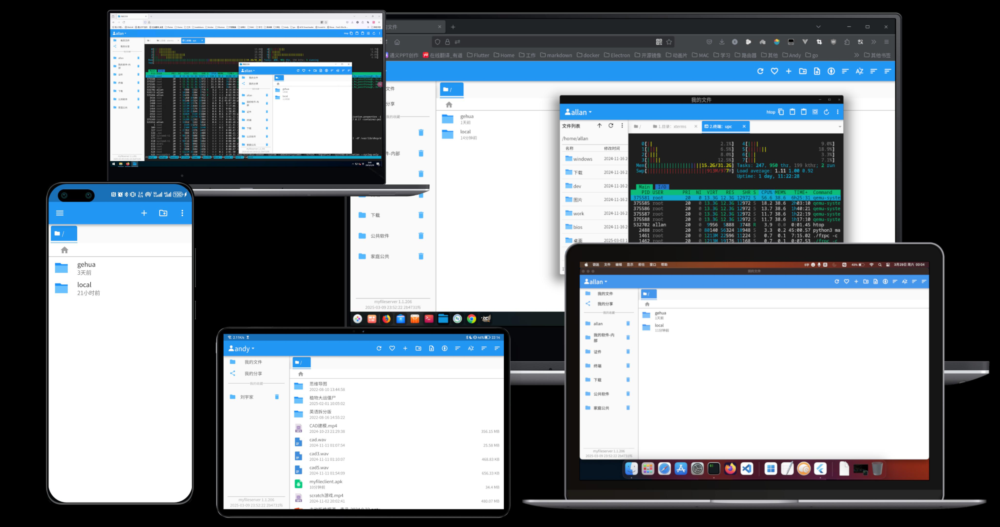

# 二、安装

## 2.1 服务器端

服务器端程序采用`go`语言编写，可以支持Linux、Windows、MacOS、路由器等各种操作系统，及x86、x64、Arm、Arm64、mips等各种硬件架构。当然，推荐使用是Linux系统。下面以Linux为例。

- 普通程序方式运行

```shell
./myfileserver.amd64.linux --dir /mnt --temp /tmp/myfileserver
```
运行以后，文件存储位置为`/mnt`，临时目录为`/tmp/myfileserver`。其余参数均为默认值。服务器端还支持以下参数：
```bash
Usage of ./myfileserver.amd64.linux:
  -cfg string
        config file name (default "fileserver.cfg")
  -debug
        run as debug mode
  -dir string
        root dir for download
  -hideDotFiles
        hide dot file
  -host string
        host fot bind (default "0.0.0.0")
  -password string
        password for super admin. empty is generate random password
  -port string
        port for download (default "8080")
  -temp string
        root dir for download
  -username string
        username for super admin. empty is disable it
```

除了从命令行传入参数，还可以通过`fileserver.cfg`，格式为：

```json
{
    "bind":{
        "ip":"0.0.0.0",
        "port":"8080"
    },
    "logger":{
        "path":"/var/log/myfileserver",
        "info_file":"info.log",
        "error_file":"err.log",
        "max_days":7,
        "info_level":0,
        "error_level":2
    },
    "server":{
        "root_dir":"",
        "temp_dir":"",
        "user_name":"",
        "password":"",
        "disable_webui":false
    }
}
```

- 以服务方式运行

  下载安装包后，执行命令：

  ```bash
  sudo bash ./install.sh
  ```

  安装完成后会自动开启服务，并在重启电脑时自动启动。安装完成后，可以在`/wls/myfileserver`中找到对应配置文件。

  1. 重启服务

     ```bash
     sudo systemctl restart myfileserver
     ```

     

  2. 查看服务器状态

     ```bash
     sudo systemctl status myfileserver
     ```

     

  3. 停止服务

     ```bash
     sudo systemctl stop myfileserver
     ```

  4. 查看日志

     ```bash
     sudo tail -f /var/log/myfileserver/info.log 
     ```

     

## 2.2 客户端

客户端程序主要使用`flutter`框架实现。其中，Web部分使用了`Vue3`。可以支持Windows、Linux、MacOS、安卓、浏览器等各种终端平台。

在Linux下，提供了`deb包`和`tar包`两种。在Windows下，提供了`安装包`和`zip包`两种。安卓系统也提供的apk程序。由于没有开发者证书，MacOS和iOS系统需要自己编译构建。

# 三、功能

## 3.1、登录

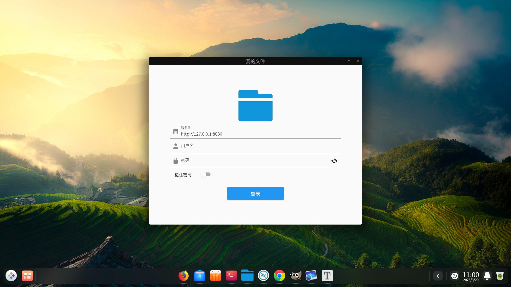

服务器地址需要改为自己的服务器地址。

## 3.2、主窗口

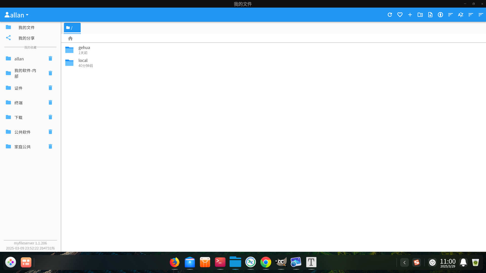

主窗口上方为工具栏，左侧为功能栏和收藏夹，右侧为文件列表。

## 3.3、设置

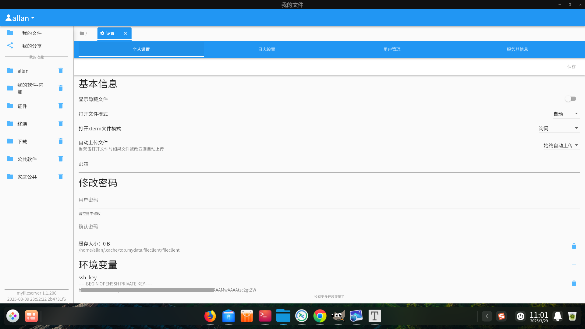

通过点击`左上角`的用户按钮，可以进入`设置`窗口。其中的配置信息会保存到服务器端，影响同账号的所有的客户端。

注意，其中环境变量是用于终端配置文件的，可以将终端的密码和公钥放入此处。

## 3.4、用户管理

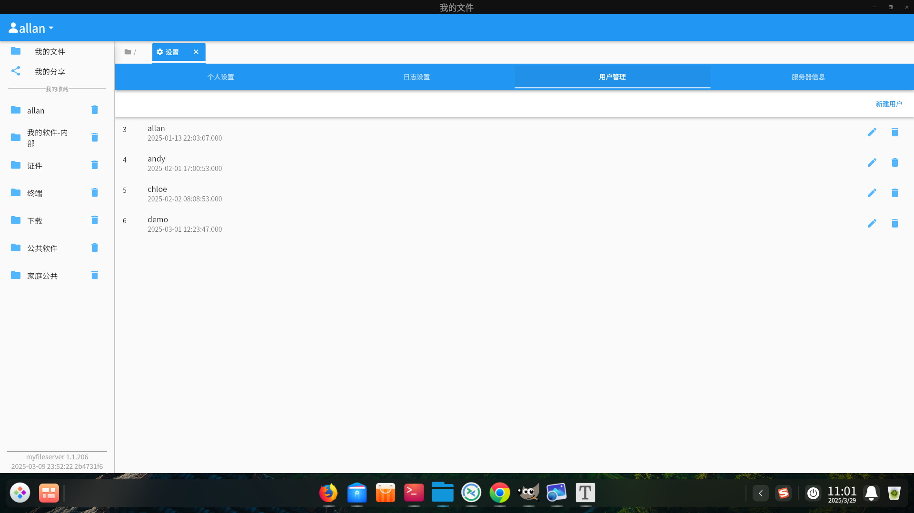

支持多个用户，可以给不同的用户设置不同的根目录。

## 3.5、服务器状态

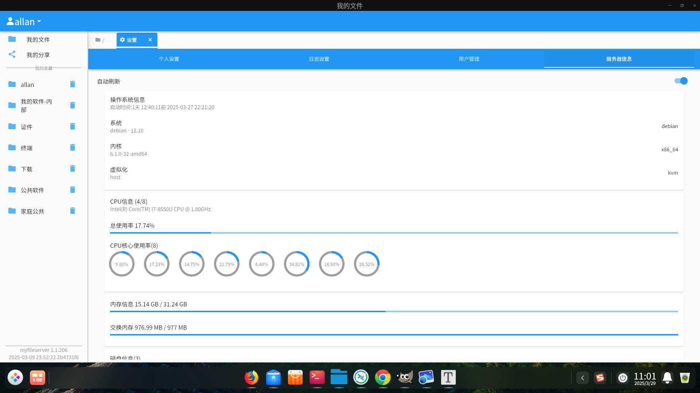

用于查看服务器资源的负载情况。

## 3.6、终端工具

内置终端工具，可以通过ssh协议登录远程服务器，对服务器进行管理。注意，在桌面端和移动端，均支持sftp上传和下载文件，在Web端不支持sftp。

- 桌面端

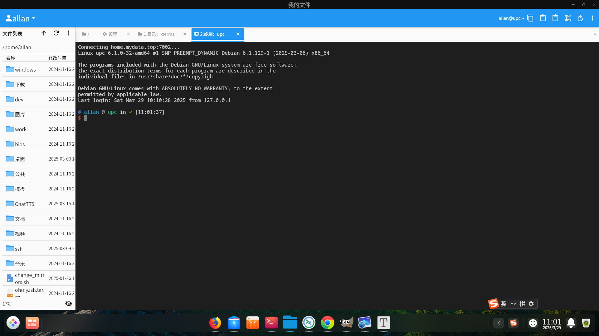

- Web端

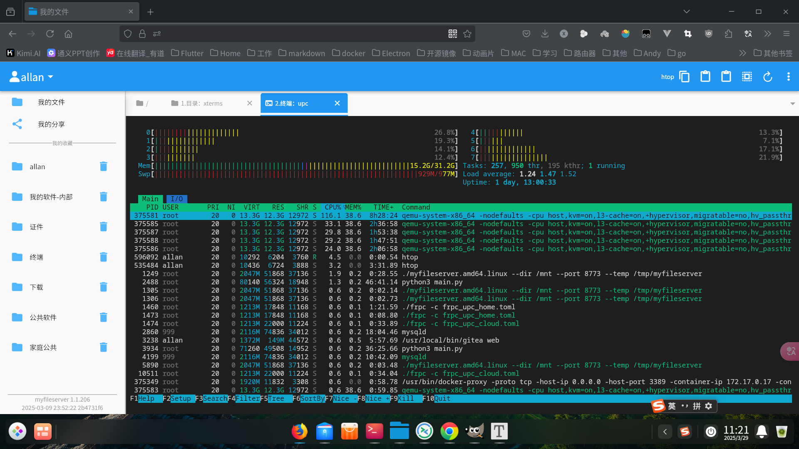

- 移动端

  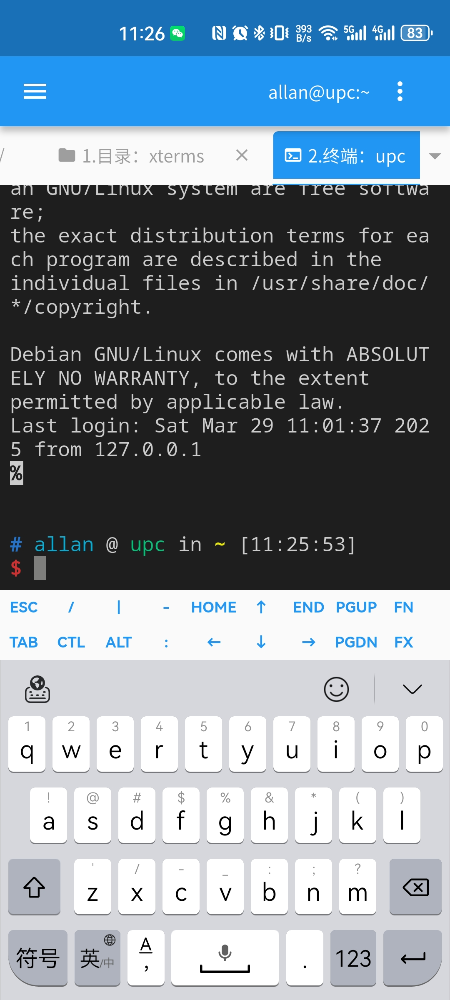

  注意：

  - 在移动端支持通过sftp协议上传和下载文件。可以使用左上角的抽屉访问。

  - 移动端默认使用安全键盘，如果想输入中文可以通过右上角菜单切换到中文键盘。

    

## 3.7、文件分享

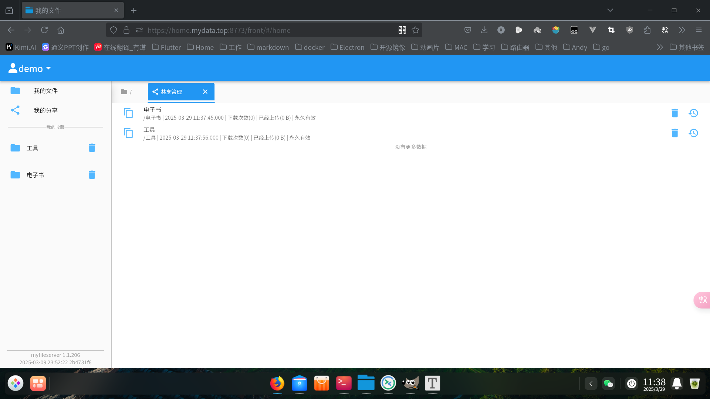

在`我的文件`中可以通过右上角工具栏中的`分享`功能将文件分享给其他人。同时赋予上传和下载权限。

在`我的分享`中可以查看并管理分享。

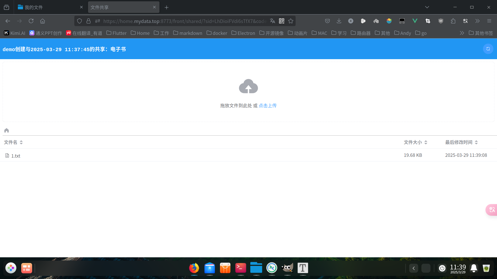

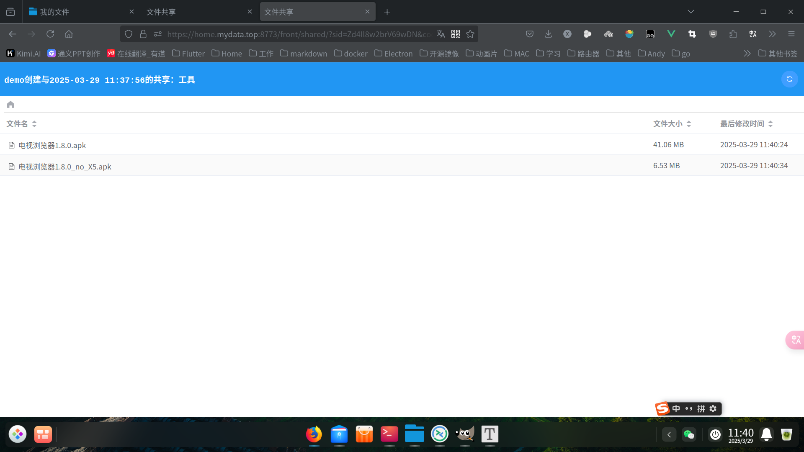
